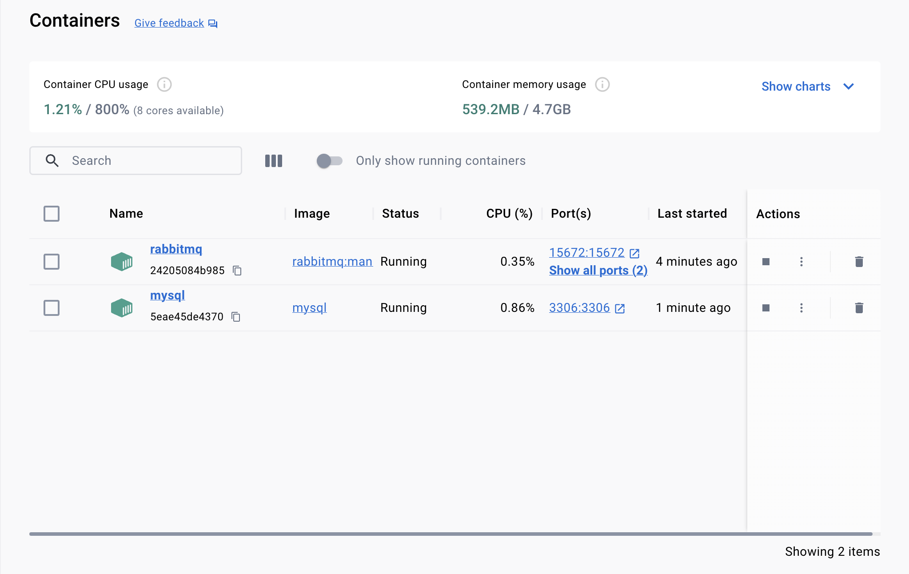

# Cevaplar

## Q1 - Senkron ve Asenkron iletişim nedir?

**Senkron** iletişimde, iletişimde bulunan tarafların birbirleriyle belirli bir zamanlama veya saat dilimi üzerinde 
anlaşmaları gerekir. Bu durumda, veri transferi gönderen ve alıcı arasında belirli bir zaman dilimi veya zaman 
çizelgesine göre gerçekleşir. Örneğin, telefonda gerçekleştirilen bir konuşma senkron iletişim örneğidir; çünkü konuşan 
kişiler aynı anda konuşurlar ve karşıdakini dinlerler.

**Asenkron** iletişimde ise, iletişimde bulunan tarafların belirli bir zaman dilimi veya saat üzerinde senkronize olmalarına 
gerek olmaz. Bu durumda, veri, gönderen tarafından gönderilir ve alıcı tarafından alındığında işlem gerçekleşir. 
İletişimdeki taraflar bağımsızdır ve herhangi bir senkronizasyon gerektirmez. Örneğin, bir kişi e-posta gönderdiğinde, 
e-posta sunucusu bu e-postayı alır ve alıcının e-posta kutusuna teslim eder. Alıcı, e-postayı açmak için uygun olduğunda, 
e-postayı alır ve okur.

Bu örneklerde, senkron ve asenkron iletişimin temel farklarını görmekteyiz. Senkron iletişimde, tarafların zamanlaması 
önemlidir ve eşzamanlı olarak gerçekleşirken, asenkron iletişimde zamanlama daha esnektir ve taraflar bağımsız olarak 
iletişim kurabilir.

## Q2 - RabbitMQ ve Apache Kafka arasındaki farklar

RabbitMQ ve Apache Kafka, her ikisi de birer mesajlaşma sistemleridir. Farklı kullanım senaryolarına ve özelliklere 
sahiptirler. Aralarındaki farklardan bazıları şunlardır:

### Mesaj Yayınlama Mimarisi:

**RabbitMQ**, bir mesaj kuyruğu sistemi olarak çalışır. Mesajlar, producer(yayıncılar) tarafından kuyruğa gönderilir ve 
ardından consumer(tüketici) uygulamalar tarafından bu kuyruktan alınır.\
**Kafka**, bir log tabanlı yayınlama sistemidir. Mesajlar bir log olarak saklanır ve consumer(tüketici) uygulamalar bu 
logu okur. Bu nedenle, Kafka'nın mesajları bir kere yayınla, çok kez tüket (publish-subscribe/pub-sub) modeline daha 
yakın olduğu söylenebilir.

### Kullanım Senaryoları:

**RabbitMQ**, genellikle iş kuyrukları, RPC (Uzak Yordam Çağrısı) ve dağıtılmış sistemler arasında mesajlaşma 
gibi senaryolarda tercih edilir.\
**Kafka**, genellikle büyük veri işleme, gerçek zamanlı veri akışı, log işleme ve analiz gibi senaryolarda tercih 
edilir.

### Dayanıklılık ve Veri Saklama:

**RabbitMQ**, mesajları diskte depolama ve dayanıklılık sağlama konusunda güçlüdür, ancak büyük veri akışları 
için Kafka kadar optimize edilmemiştir.\
**Kafka**, mesajları diskte tutar ve dayanıklılık sağlar. Ayrıca, mesajları uzun süre saklama ve geri alma konusunda 
da etkilidir.

### Ölçeklenebilirlik:

**RabbitMQ**, dikey ölçeklenebilirlik (yani, tek bir sunucuyu daha güçlü hale getirme) sağlar, ancak yatay 
ölçeklenebilirlik (yani, birden çok sunucu ekleyerek kapasiteyi artırma) konusunda sınırlıdır.\
**Kafka**, yatay ölçeklenebilirlik konusunda daha iyidir. Birden çok broker ekleyerek kolayca ölçeklenebilir.

### Performans:

**RabbitMQ**, düşük gecikme süresi ve yüksek performans sunar, ancak Kafka kadar büyük veri akışları için 
optimize edilmemiştir.\
**Kafka**, yüksek performans ve düşük gecikme süresi sağlar ve büyük veri akışları için optimize edilmiştir.

>Bu farklar göz önüne alındığında, RabbitMQ genellikle geleneksel mesajlaşma senaryoları için tercih edilirken, 
Kafka genellikle büyük veri işleme ve gerçek zamanlı veri akışı gibi senaryolar için tercih edilir.


## Docker ve Virtual Machine nedir?

Docker ve Virtual Machine(VM), yazılım geliştirme ve dağıtımı için kullanılan sanallaştırma teknolojileridir. 
İkisi de farklı amaçlar için kullanılır ve farklı çalışma prensiplerine sahiptir.

**Docker**

- Yazılım uygulamalarını konteynerlara paketleyen ve çalıştıran bir platformdur.
- Konteynerlar, uygulama ve tüm bağımlılıklarını (kütüphaneler, ortamlar, yapılandırmalar vb.) tek bir birimde bir 
araya getirir.
- Konteynerler, hafif ve hızlıdır ve sistem kaynaklarını daha verimli kullanır.
- Uygulamaları herhangi bir ortamda (lokal makineler, sunucular, bulut hizmetleri vb.) çalıştırabilmeyi sağlar.

**Virtual Machine(VM)**

- Sanal makine, fiziksel bir bilgisayarda çalışan sanal bir bilgisayar sistemidir.
- Her bir sanal makine, kendi işletim sistemi, uygulamaları ve kaynaklarına sahiptir.
- Sanal makineler, fiziksel makineler üzerinde çalışan bir sanallaştırma yazılımı (hypervisor) kullanılarak oluşturulur.
- VM'ler, her biri birbirinden izole edilmiş ve bağımsız olarak çalışabilen tam bir işletim sistemi ortamı sağlar. 


> Docker ve VM arasındaki temel fark, Docker'ın konteynerlar aracılığıyla uygulamaları izole etmesi ve çalıştırması,
için kullanılırken, VM ise tam bir sanal makine ortamı sağlamasıdır. Docker genellikle hafif ve hızlı uygulamalar 
için tercih edilirken, VM daha ağır ve daha izole edilmiş bir ortam gerektiren uygulamalar için tercih edilir.


## Docker ile kurulum
```
docker run -d --name rabbitmq -p 5672:5672 -p 15672:15672 rabbitmq:management
```

Yukarıdaki komut ile RabbitMQ container'ını çalıştırabiliriz. Bu komutu kullanırsak RabbitMQ 5672 portu üzerinde 
çalışmaya başlar. 15672 portunda ise RabbitMQ arayüzü çalışır. Bu komut ile çalışan container ismini rabbitmq yapmış 
oluyoruz.

```
docker run -d --name mysql -e MYSQL_ROOT_PASSWORD=secret-password -p 3306:3306 mysql
```

Yukarıdaki komutta ise mysql container'ı ayağa kaldırıyoruz. User ismi vermediğimizden default olarak root olacaktır,
şifre ise burada verdiğimiz gibi secret-password olacaktır. Çalışacağı port ise 3306 olacaktır.

---

**RabbitMQ command:**


---

**MySQL command:**


---

**Pull'ladığım imagelar:**


---

**Çalışan container'lar:**



## Docker komutları

- **docker pull**: Bir Docker imajını (image) Docker Hub veya başka bir imaj deposundan çeker.
- **docker run**: Bir Docker imajını çalıştırır ve bir konteyner oluşturur.
- **docker ps**: Çalışan konteynerleri listeler.
- **docker stop**: Bir konteyneri durdurur.
- **docker rm**: Bir konteyneri siler.
- **docker images**: Docker imajlarını listeler.
- **docker rmi**: Bir Docker imajını siler.
- **docker-compose up**: Docker Compose ile belirtilen hizmetleri başlatır.
- **docker-compose down**: Docker Compose ile belirtilen hizmetleri durdurur ve kaldırır.


## Monolitik mimari ve Mikroservis mimari

Monolitik bir uygulama, birden fazla modülün bir arada bulunduğu tek bir kod tabanına sahiptir. Modüller işlevlerine göre
ayrılmış olabilir. Monolitik mimaride bütün uygulama tek halde olduğundan, bir build ile bütün projeyi ayağa kaldırabiliriz.
Proje tek bir bütün olduğundan herhangi bir değişiklik yapıldığında alakalı, alakasız bütün kısımlar tekrardan deploy 
edilmesi gerekir. Buradaki değişiklik sadece yeni bir özellik eklemek değil, bir versiyon yükseltme bile olabilir.

Mikroservis ise tek işe odaklı parçalar halinde çalışır. Her mikroservis kendi işiyle ilgilenir, diğer mikroservislerin
içeriğini bilmemelidir. Servisler arasındaki bağımlılıklar, loose-coupled ilkesine bağlı şekilde geliştirilmiş olur.
Bu bakımdan, mikroservis yaklaşımı ölçeklenebilirlik, esneklik ve çeviklik gibi önemli avantajlar barındırır.

Günümüzde direkt olarak mikroservis yaklaşımı ile proje geliştirmeye başlamak yerine monolitik bir uygulama geliştirmek
daha mantıklıdır. Böylelikle proje büyüdükçe, aldığı trafik arttıkça ve artık yapılan işlemlerin bölünmesi gerektiğine
karar verildiğinde, monolitik yaklaşımdan mikroservis yaklaşımına geçmek gerekir.

**Monolitik mimarinin avantajları**

- Daha kolay hata ayıklama ve test etme
- Kolay deploy edebilme
- Geliştirme yapmak mikroservise göre daha kolaydır

**Monolitik mimarinin dezavantajları**

- Karmaşıklık
- Değişiklik yapma zorluğu
- Ölçeklenebilirliğinin zayıf olması

**Mikroservis mimarisinin avantajları**

- Bağımsız bileşenler
- Daha iyi ölçeklenebilirlik
- Daha çevik geliştirmeye yatkın olması

**Mikroservis mimarisinin dezavantajları**

- Ekstra karmaşıklık
- Sistem dağıtımı ve takibi
- Yönetim ve izlenebilirliğin zorluğu
- Test zorluğu

## API Gateway, Load Balancer ve Service Discovery

### API Gateway

API Gateway, bir yazılım mimarisinde, istemcilerin (örneğin, web tarayıcıları veya mobil uygulamalar) bir dizi 
mikroservise erişimini yöneten bir sunucu. API Gateway, gelen istekleri alır, doğrular, yönlendirir ve gerektiğinde 
birden fazla mikroservis çağrısını koordine eder. Bu, istemciler için tek bir noktadan API'ye erişim sağlar ve 
mikroservisler arasındaki karmaşıklığı gizler.

API Gateway'in temel görevlerinden bazıları şunlardır:

- İstek Yönlendirme: Gelen istekleri doğru mikro servislere yönlendirme.
- Güvenlik: Kimlik doğrulama, yetkilendirme ve güvenlik politikalarını uygulama.
- Protokol Dönüşümü: Farklı istemci ve servisler arasında uygun protokollerin kullanılmasını sağlama.
- Yük Dengeleme: Trafik yükünü dengeleyerek servislerin performansını artırma.
- Önbellekleme: Sık kullanılan isteklerin sonuçlarını önbelleğe alma ve tekrar istenildiğinde önbellekten yanıt verme.
- Hata Yönetimi: Hataları yönetme ve kullanıcıya uygun hata mesajlarını döndürme.
- Analytics ve İzleme: API trafiğini izleme, analiz etme ve raporlama.

Kısacası, API Gateway, mikroservis mimarilerinde kullanışlıdır çünkü karmaşık mikroservis ağlarını yönetmeyi ve 
istemcilere basit ve tutarlı bir API sunmayı sağlar. Ayrıca, güvenlik ve performans iyileştirmeleri gibi önemli 
işlevleri de üstlenir.


### Load Balancer

Load balancer, ağdaki trafik yükünü dengelemek ve dağıtmak için kullanılan bir cihaz veya yazılımdır. Load balancer, 
ağda bulunan birden fazla sunucu veya hizmet arasında gelen istekleri dağıtarak yükü eşit bir şekilde paylaştırır. 
Bu sayede, hizmetlerin performansı artar, tek bir sunucuya veya hizmete aşırı yüklenme engellenir ve hizmetlerin 
yüksek erişilebilirliği sağlanır.

**Yük Dengeleme**: Gelen istekleri sunucular arasında eşit bir şekilde dağıtmak için çeşitli algoritmalar
kullanır. Örneğin, Round Robin, Least Connections, Weighted Round Robin gibi algoritmalar yaygın olarak kullanılır.

**Sağlık Kontrolü**: Sunucuların durumunu düzenli olarak kontrol ederek, çalışmayan veya hatalı sunucuları trafikten
çıkarır ve sadece sağlıklı sunuculara yönlendirme yapar.

**Protokol Dönüşümü**: Farklı protokolleri (HTTPS, UDP vb.) destekleyerek, farklı istemci ve sunucu yapıları arasında 
uygun protokollerin kullanılmasını sağlar.

**Önbellekleme**: Sık kullanılan içerikleri önbelleğe alarak, tekrar eden isteklerin hızlı bir şekilde yanıtlanmasını 
sağlar.

Kısacası, Load balancer, genellikle büyük ölçekli ağlarda ve bulut tabanlı hizmetlerde kullanılır. Yüksek 
trafikli web siteleri, uygulama sunucuları, veritabanı sunucuları gibi sistemlerde performansı artırmak ve 
yükü dengelemek için yaygın olarak kullanılan bir bileşendir.


### Service Discovery

Bir ağdaki hizmetlerin dinamik olarak bulunmasını ve erişimini sağlayan bir süreç veya mekanizmadır. Bu mekanizma, 
mikroservis mimarileri gibi dağıtık sistemlerde önemlidir çünkü bu sistemlerde hizmetler sürekli olarak başlatılıp 
durdurulabilir ve IP adresleri gibi değişkenler olabilir.

Service Discovery'nin temel amacı, istemcilerin(örneğin, bir uygulama veya hizmet) belirli bir servisi bulmak ve 
onunla iletişim kurmak için ihtiyaç duydukları bilgilere dinamik olarak erişmelerini sağlamaktır. Bu sayede, 
servislerin IP adresleri veya bağlantı noktaları gibi değişkenler, servislerin otomatik olarak keşfedilmesi ve 
kullanılabilir olması için yönetilir.

1. **Service Registry**: Servislerin kaydedildiği ve güncellendiği bir veritabanı gibi düşünülebilir. Servisler
başlatıldığında veya durduğunda, bu değişiklikler Service Registry'e kaydedilir.

2. **Service Discovery Client**: Servisleri bulmak için istemciler tarafından kullanılan bir kütüphanedir. 
Bu kütüphane, Service Registry ile iletişim kurar ve istemcilere servislerin konumunu sağlar.

3. **Service Discovery Server**: Service Registry'yi yöneten ve istemcilere servisleri nasıl bulacaklarını söyleyen 
bir sunucudur. İstemciler bu sunucuya istek gönderir ve servislerin konumunu alır.

Kısacası, **Service Discovery**, ölçeklenebilir ve esnek bir yapı sağlayarak mikroservis mimarilerinde ve bulut 
tabanlı uygulamalarda kullanımı yaygın olan bir kavramdır. Bu sayede, servislerin dinamik olarak yönetilmesi ve 
keşfedilmesi kolaylaşır, sistemler daha esnek hale gelir ve uygulama geliştirme süreçleri hızlanır.


## Hibernate, JPA, Spring Data Frameworkleri


### Hibernate

Hibernate, Java programlama dilinde yazılmış bir ORM (Object-Relational Mapping) framework'üdür. ORM, nesne yönelimli 
programlama ve ilişkisel veritabanı arasındaki veri uyumluluğunu sağlayan bir tekniktir. Hibernate, bu uyumluluğu 
sağlamak için Java nesnelerini ilişkisel veritabanı tablolarına otomatik olarak eşleştirir ve veri işlemlerini 
kolaylaştırır.

Hibernate, veritabanı bağlantısını yönetmek, SQL sorgularını oluşturmak ve veritabanı işlemlerini gerçekleştirmek için 
bir dizi araç ve yöntem sunar. Bu sayede, geliştiricilerin veritabanı işlemleriyle uğraşırken daha az zaman harcaması 
ve daha az hata yapması sağlanır. Ayrıca, Hibernate sayesinde veritabanı bağımsızlığı da sağlanabilir, yani uygulama 
farklı veritabanlarıyla çalışabilir ve kod değişikliği yapmadan çalışmaya devam edebilir.

Hibernate, özellikle büyük ve karmaşık veritabanı işlemleri gerektiren uygulamalar için idealdir. ORM tekniklerini 
kullanarak veritabanı işlemlerini basitleştirir ve geliştirme sürecini hızlandırır.


### JPA


JPA (Java Persistence API), Java platformunda nesnelerin ilişkisel veritabanlarıyla etkileşimini kolaylaştıran bir 
API'dir. JPA, ORM (Object-Relational Mapping) prensiplerini kullanarak, Java sınıflarını ve veritabanı tablolarını 
ilişkilendirir ve veritabanı işlemlerini daha kolay hale getirir.

JPA'nın temel amacı, Java programcılarına veritabanı işlemlerini gerçekleştirmek için standart bir yol sunmaktır. 
Bu sayede, veritabanı işlemleri için gereken kod miktarı azalır, veritabanı bağlantıları ve sorguları daha kolay 
yönetilir ve kod tekrarı önlenir.

JPA'nın bazı temel özellikleri şunlardır:

- **Entity ve EntityManager**: JPA, veritabanı tablolarını temsil eden Java sınıflarına "entity" denir. EntityManager,
bu entity'lerle etkileşim sağlayan ana arayüzdür.

- **Annotation'lar**: JPA, entity sınıflarını tanımlamak için çeşitli annotation'ları kullanır. Örneğin, @Entity 
annotation'ı bir sınıfın bir entity olduğunu belirtir.

- **JPQL (Java Persistence Query Language)**: JPA, veritabanından veri sorgulamak için JPQL adı verilen bir sorgu 
dilini kullanır. JPQL, SQL'ye benzer ancak entity'ler üzerinde çalışır.

- **Transaction Management**: JPA, veritabanı işlemlerini transactionlar halinde yönetir. Bu sayede, işlemlerin 
güvenli ve tutarlı olması sağlanır.

JPA, popüler ORM framework'leri arasında en yaygın olarak kullanılanlardan biridir ve Hibernate gibi ORM 
implementasyonlarıyla sıkça kullanılır.

## Spring Data

Spring Data, Spring ekosisteminde veritabanı işlemlerini kolaylaştıran ve standartlaştıran bir framework'tür. 
Çeşitli veritabanı teknolojileriyle etkileşim sağlamak için kullanılabilir ve veritabanı işlemlerini daha 
hızlı ve daha az kod yazarak gerçekleştirmeyi sağlar.

Spring Data'nın temel amacı, veritabanı işlemlerini kolaylaştırmak ve standartlaştırmaktır. Bu sayede, geliştiriciler 
veritabanı işlemleriyle uğraşırken daha az zaman harcar ve daha az hata yapar. Spring Data, aynı zamanda çeşitli 
veritabanı teknolojileriyle entegrasyonu destekler ve bu teknolojiler arasında geçiş yapmayı kolaylaştırır.

- **Repository Interface**: Spring Data, veritabanı işlemlerini gerçekleştirmek için Repository interface'leri kullanır. Bu 
interface'ler, temel veritabanı işlemlerini (ekleme, güncelleme, silme, sorgulama vb.) tanımlar.

- **Query Methods**: Spring Data, Repository interface'lerine özel query method'larını tanımlama imkanı sağlar. Bu method'lar,
belirli bir sorguyu ifade eder ve Spring Data, bu method'ları otomatik olarak uygun SQL veya JPQL sorgularına dönüştürür.

- **Pagination and Sorting**: Spring Data, verilerin sayfalama ve sıralama işlemlerini kolaylaştırır. Bu sayede, büyük veri 
kümesi üzerinde çalışırken performansı artırabilir.

- **Auditing**: Spring Data, veritabanına eklenen veya güncellenen verilerin kim tarafından ve ne zaman değiştirildiğini 
otomatik olarak takip edebilir.

Spring Data, genellikle Spring projelerinde kullanılan bir modül olarak kullanılır ve Hibernate, JPA, MongoDB, Redis 
gibi çeşitli veritabanı teknolojileriyle entegrasyonu destekler. Bu sayede, Spring geliştiricileri veritabanı 
işlemlerini daha hızlı ve daha güvenli bir şekilde gerçekleştirebilirler.